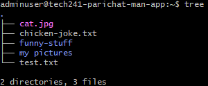

# Linux Commands
*Displays files except hidden files in the directory*
```bash
ls
```
*Displays present working directory*
```bash
pwd
```
*Displays all commands which related uname*
```bash
uname --help
```
*Displays all commands used*
```bash
history
```
*Displays the processes that is currently running*
```bash
ps
```
*Navigate to your home directory*
```bash
cd 
```
*Navigates to / (root) directory*
```bash
cd .
```
*Move a directory level up*
```bash
cd ..
```
Downloads a file from the url 
```bash
curl <url> --output <name>
```
*Checks file type*
```bash
file <filename>
```
*Creates a new directory*
```bash
mkdir <name>
```
*Changes a file name*
```bash
mv <current_filename> <new_filename>
```
*Copies a file*
```bash
cp <current_filename> <new_filename>
```
*Makes a new file*
```bash
touch <name>
```
*nano is an editor where you can edit the file*
```bash
nano <filename>
```
*Shows the detail in the file*
```bash
cat <filename>
```
*Shows the context of first two lines in the file*
```bash
head -2 <filename>
```
*Shows the context of last two lines in the file*
```bash
tail -2 <filename>
```
*Shows numbers of line in the file along with the context*
```bash
nl <filename>
```
*Install packages sodu command is for accessing super user permissions*
```bash
apt install <package>
sodu apt install <package>
```
*Update sources -y is optional used to ask linux to say yes to everything.(This is used when `apt install` comes up with error)*
```bash
sodu apt update -y
```
*tree shows the file or folder structure*
```bash
tree
```


*Move a file from home directory to a folder*
```bash
mv <filename> <directory>/<directory>
mv chicken-joke.txt funny-stuff/funny-jokes/
```
*Move a file from home directory to a folder when you are inside that folder*
```bash
mv ../chicken-joke.txt/. 
```
*Move a file from a directory to home directory*
```bash
mv <filename> ~
mv bad-joke.txt ~
```

## Command for running a script in Linux
*Upgrade packages*
```bash
sudo apt upgrade -y
```
*Install nginx*
```bash
sudo install nginx
```
*Start nginx*
```bash
sudo systemctl start nginx
```
*Restart nginx*
```bash
sudo systemctl restart nginx
```
*Enable nginx*
```bash
sudo systemctl enable nginx
```
*Check if nginx is enabled*
```bash
sudo systemctl is-enabled nginx
```
check the status of nginx
```bash
sudo systemctl status nginx
```
*Displays environment variables*
```bash
printenv
```
*Create environment variable*
```bash
export <VARIABLE_NAME>=<Name>
```
*Running a script if in the current directory*
```bash
./<filename>
```
*Create a persistent environment variable*

locate .bashrc and edit the file by going to the end 
```bash
export MYNAME=parichat
```
*Reloads configuration file*
```bash
source .bashrc
```

## Processes
There are 2 tpyes of processes in Linux which are ststem processes and user processes. Each process has its own unique process ID (PID)

### Commonly used command 
`ps` displays information about active processes.

`ps aux` displays a detailed list of processes running on the system