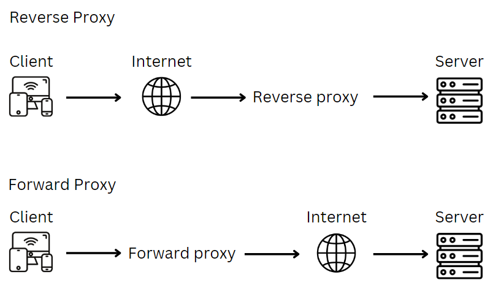

# Reverse Proxy

### 1) What are ports?

   a port is a communication endpoint which is used to identify a specific process. Ports allow computers to to differentiate between different types of traffic.

### 2) What are reverse proxy? How is it different to a proxy?

   Reverse proxy is a server that sits between client and web servers. It receives requests and then forward those to the backend servers. The reverse proxy protects the backend servers from direct client connections, providing benefits such as enhanced security, scalability and flexibitily.
   Whereas forward proxy is a server that sits in front of the client machine and acts as a go-bewteen client devices and the servers. When requests are made, the forward proxy intercepts those requests and then communicates with the web servers on behalf of those clients.

### 3) Diagram

   

### 4) What is Nginx's default configuration?

   A common location for default configurations is the *site-available* directory.

### 5) How do you set up a nginx reverse proxy?

**Set up reverse proxy manually**

1) Run 
   ```
   sudo nano /etc/nginx/sites-available/default
   ```

2) Locate 
   ```bash
   server_name _;

         location / {
                  # First attempt to serve request as file, then
                  # as directory, then fall back to displaying a 404.
                  try_files $uri $uri/ =404;
         }
   ```
3) Change 
   ```
   try_files $uri $uri/ =404;
   ``` 
   to
   ```
   proxy_pass http://localhost:3000;
   ```

4) Restart nginx
   ```
   sudo systemctl restart nginx
   ```

**Set up reverse proxy on the script**

   1) Using `sed` command to replace  `proxy_pass http://localhost:3000;` with `try_files $uri $uri/ =404;`

   ```bash
   sudo sed -i 's@try_files $uri $uri/ =404;@proxy_pass http://localhost:3000;@g' /etc/nginx/sites-available/default
   ```
   Replacing `/` with `@` to avoid the conflict with the forward slashes that is in the orginal lines.

   2) Restart nginx
   ```bash
   sudo systemctl restart nginx
   ```

## The full script with reverse proxy
```bash
#!/bin/bash

# update
sudo apt update -y

# upgrade
sudo apt upgrade -y

# install nginx - when installed it starts autometically
sudo apt install nginx -y

# restart nginx
sudo systemctl restart nginx

# enable nginx - makes sure that when vm is restarted, ngix auto start on reboot
sudo systemctl enable nginx

# install nodejs
curl -sL https://deb.nodesource.com/setup_12.x | sudo -E bash -

# download nodejs
sudo apt install nodejs -y

# node package manager
sudo npm install pm2 -g

# copy app folder to VM
git clone https://github.com/jungjinggg/tech241_sparta_app.git app

# set env variable for the app to look up data from
export DB_HOST=mongodb://172.187.161.179:27017/posts

# set reverse proxy
sudo sed -i 's@try_files $uri $uri/ =404;@proxy_pass http://localhost:3000;@g' /etc/nginx/sites-available/default

# restart nginx
sudo systemctl restart nginx

# go into the app folder
cd /home/adminuser/app/app

# install npm
npm install

# run sparta node app in the background
pm2 start app.js

```

